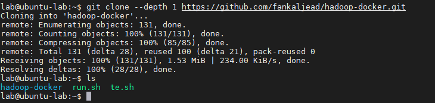
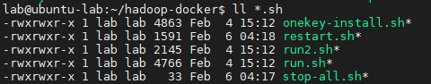

# 基于 Docker 的 Hadoop 的实验环境

本环境基于 [jeth123/hadoop-docker](https://github.com/jeth123/hadoop-docker) ，并在其基础上添加了 `Azkaban` `kafka` `sbt` 

[Oringina-README](./README-oringinal.md)

## 软件版本

-  操作系统: CentOS 6

- Java环境: OpenJDK 8

- Hadoop: 2.7.2

- Spark: 2.1.0

- Hive: 2.1.1

- HBase: 1.2.2

- Zookeeper: 3.4.8

- Azkaban: 3.90.0
- Sbt: 1.4.6
- Kafka: 2.7.0
- Python3.6
- Gradle: 4.6

- 基于docker-compose管理镜像和容器，并进行集群的编排

 所有软件的二进制包均通过网络下载。其中包含自行编译的Hadoop和Protobuf二进制包，保存在Github上，其它软件的二进制包均使用Apache官方镜像。

## 安装过程

首先需要一台装好 `docker` 和 `docker-compose` 的Ubuntu 或者 Centos 虚拟机


然后克隆本仓库

```bash
git clone --depth 1 https://github.com/fankaljead/hadoop-docker.git
```



进入hadoop-docker目录

```bash
cd hadoop-docker
ls *.sh
```



给脚本赋予可执行的权限

```shell
chmod +x *.sh
```


|  脚本名称  |              脚本作用              | 使用方法                  |
| :--------: | :--------------------------------: | ------------------------- |
|   run.sh   |          第一次安装时使用          | 首先进入hadoop-docker目录 |
|            |                                    | 然后执行 `./run.sh`       |
|  run2.sh   | 已经安装docker和docker-compose使用 | 首先进入hadoop-docker目录 |
|            |                                    | `./run2.sh`               |
| restart.sh |         虚拟机重启之后使用         | 首先进入hadoop-docker目录 |
|            |                                    | 然后执行`restart.sh`      |

- 安装 hadoop-docker 实验平台

  ```shell
  # cd hadoop-docker 进入hadoop-docker 目录
  # chmod +x *.sh 给脚本赋予可执行权限
  # 如果已经执行上面命令
  # 执行脚本
  ./run.sh
  
  # ./run2.sh
  ```

  注意此安装过程会从 [dockerhub](https://hub.docker.com/) 拉取镜像文件，这里会很耗时间(还可能很多次重试)，取决于网络情况，强烈建议开启代理和docker镜像加速

- 重启后重新开启hadoop-docker实验平台

  ```shell
  # cd hadoop-docker 进入hadoop-docker 目录
  # chmod +x *.sh 给脚本赋予可执行权限
  # 如果已经执行上面命令
  # 执行脚本
  ./restart.sh
  ```

## 容器使用情况

|     Name     |   节点作用   |
| :----------: | :----------: |
| hbase-master | 主节点 zoo1  |
| hbase-slave1 | 子节点1 zoo2 |
| hbase-slave2 | 子节点2 zoo3 |
| hbase-slave3 |   子节点3    |
|    mysql     | mysql 数据库 |

## 相关端口映射

|    容器名称    |           端口作用            | 容器端口 | 虚拟机端口 |
| :------------: | :---------------------------: | :------: | :--------: |
| `hbase-master` | `Azkaban jetty solo` 服务端口 |   9090   |    9090    |
|                |                               |   8080   |    8080    |
|                |                               |   4040   |    4040    |
|                |                               |   9092   |    9092    |
|                |                               |   2181   |    2181    |
|                |                               |   8088   |    8088    |
|    `mysql`     |         `mysql` 端口          |   3306   |    3306    |

