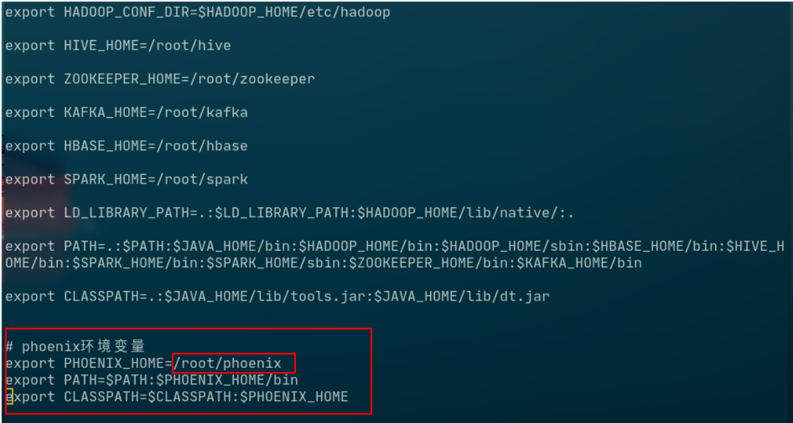
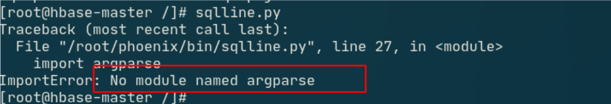
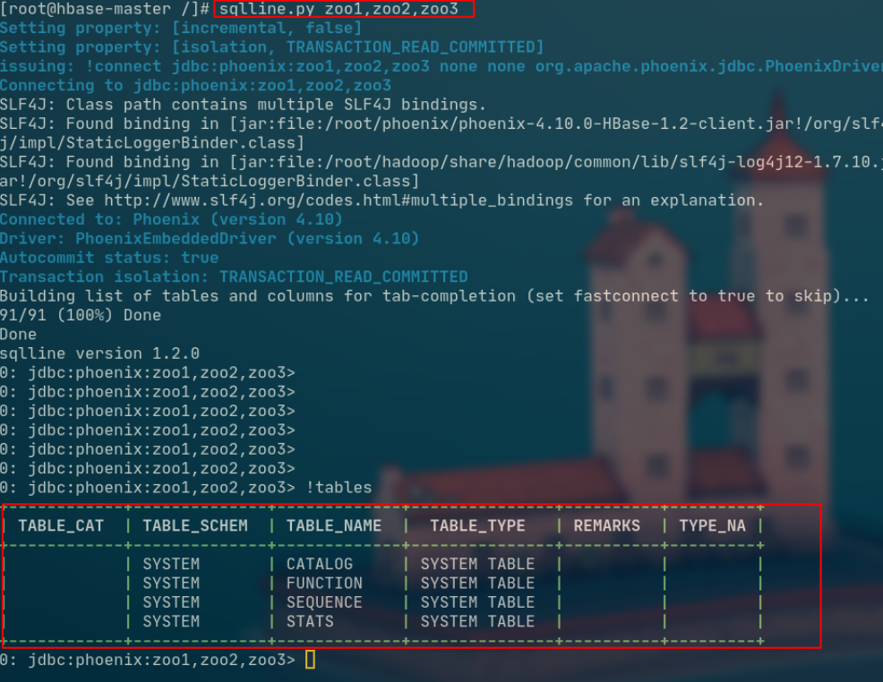

# Phoenix 安装

1. [下载 Phoenix](http://archive.apache.org/dist/phoenix/apache-phoenix-4.10.0-HBase-1.2/bin/apache-phoenix-4.10.0-HBase-1.2-bin.tar.gz) 

2. 解压

   ```shell
   tar zxvf apache-phoenix-4.10.0-HBase-1.2-bin.tar.gz 
   # 修改文件夹名字
   mv apache-phoenix-4.10.0-HBase-1.2-bin apache-phoenix
   ```

3. 将 Phoenix 上传到 hbase-master

   ```shell
   docker cp apache-phoenix hbase-master:/root
   ```

4. 配置环境变量，将下面内容写入 `/root/.bashrc`

   ```shell
   #vim .bashrc
   
   export PHOENIX_HOME=/root/apache-phoenix
   export PATH=$PATH:$PHOENIX_HOME/bin
   export CLASSPATH=$CLASSPATH:$PHOENIX_HOME]()
   ```

   

   `source /root/.bashrc`  使环境变量生效

5. 配置hbase

   ```shell
   # 拷贝 jar 包
   cp apache-phoenix/phoenix-4.10.0-HBase-1.2-client.jar hbase/lib/
   
   # 将jar包分发给其它节点
   scp hbase/lib/phoenix-4.10.0-HBase-1.2-client.jar \hbase-slave1.hadoop-docker:/root/hbase/lib
   ```

   在hbase-master `phoenix/bin/hbase-xml `中添加

   ```xml
   <property>
   	<name>phoenix.schema.isNamespaceMappingEnabled</name>
   	<value>true</value>
   </property>
   ```

   在hbase-master `hbase/conf/hbase-site.xml, `中添加

   ```xml
   <property>
       <name>phoenix.schema.isNamespaceMappingEnabled</name>
       <value>true</value>
   </property>
   ```

   分发 `/root/hbase/conf/hbase-site.xml` 包分发到其他节点

   ```shell
   scp hbase/conf/hbase-site.xml hbase-slave1.hadoop-docker:/root/hbase/conf
   scp hbase/conf/hbase-site.xml hbase-slave2.hadoop-docker:/root/hbase/conf
   scp hbase/conf/hbase-site.xml hbase-slave3.hadoop-docker:/root/hbase/conf
   ```

   将hdfs集群中的配置文件 `core-site.xml`、`hdfs-site.xml`拷贝到Phoenix的bin目录下

   ```shell
   cp hadoop/etc/hadoop/hdfs-site.xml hadoop/etc/hadoop/core-site.xml phoenix/bin
   ```

   重启hadoop zookeeper hbase

   

6. 启动phoenix

   ```shell
   sqlline.py zoo1,zoo2,zoo3
   ```

   如果遇到下面这种

   

   请安装这个包

   ```shell
   yum install python-argparse -y
   ```

   启动过程中可能会遇到下面的问题

   ```shell
   org.apache.hadoop.hbase.TableNotFoundException:\Table 'SYSTEM:CATALOG' was not found, got: \SYSTEM.MUTEX. (state=,code=0)~
   ```

   - 首先关闭 hbase

     ```shell
     stop-hbase.sh
     ```

   - 然后

     ```shell
     /bin/hbase clean --cleanAll
     start-hbase.sh
     ```

   - 最后尝试连接

     ```shell
     sqlline.py zoo1,zoo2,zoo3
     ```

     


7. 成功

   愉快的学习吧 ☺：）！